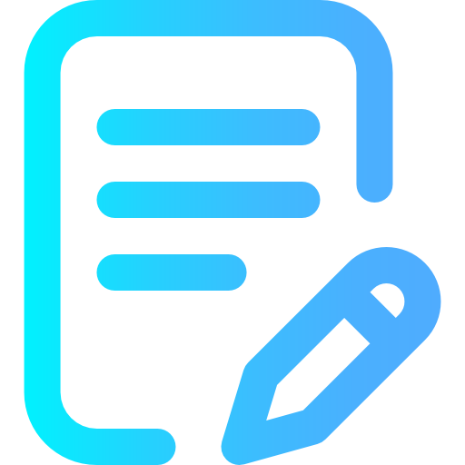
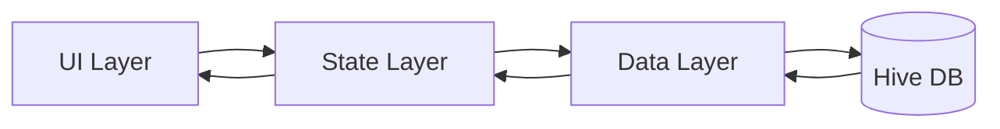

# 📓 Notely — Premium Digital Notebook

<p align="center">
  
</p>

<p align="center">
  <strong>A sophisticated, modern note-taking experience crafted for elegance and productivity.</strong><br>
  <em>Designed for high-end visual appeal and professional university presentation.</em>
</p>

<p align="center">
  
  
  
  
</p>

---

## 🌌 The Visual Experience

Notely isn't just a tool; it's a visual statement. We've implemented a **"Midnight" aesthetic** that balances deep atmospheric tones with vibrant accents.

### 🌓 Adaptive Theming
- **Premium Dark Mode**: A curated palette of **Slate 900** and **Slate 800**, avoiding pure black for a softer, more expensive feel.
- **Ethereal Backgrounds**: Subtle linear gradients that add depth and a sense of space to the interface.
- **Luminous Accents**: Vibrant Indigo highlights that guide the user's eye to key actions.

### ⚡ Fluid Interactions
- **Hero Animations**: Seamlessly glide from the note list into the editor.
- **Glassmorphism**: Semi-transparent surfaces that blend elegantly with the background.
- **Micro-interactions**: Haptic-like ripples, soft scaling on press, and a "glow" effect on the FAB.

---

## ✨ Core Capabilities

| Feature | Description |
| :--- | :--- |
| **🎯 Intelligent Search** | Real-time, ultra-responsive filtering with a floating modern search bar. |
| **✍️ Focus Editor** | A borderless, distraction-free writing environment for pure creativity. |
| **📁 Persistent Vault** | High-performance local storage via Hive NoSQL, ensuring your notes are always there. |
| **🧤 Intuitive UX** | Swipe-to-delete gestures, a welcoming empty state, and smart navigation guards. |
| **🌙 Theme Mastery** | One-tap transition between a crisp Light mode and a luxurious Dark mode. |

---

## 🏗️ Engineering Architecture

Notely is built on a clean, scalable 3-layer architecture to ensure maintainability and performance.



- **UI Layer**: `home_screen.dart`, `note_editor_screen.dart` (Material 3)
- **State Layer**: `NoteProvider`, `ThemeProvider` (Provider Pattern)
- **Data Layer**: `NoteStorage` (Hive NoSQL Wrapper)

---

## 🛠️ Tech Stack

- **Framework**: [Flutter](https://flutter.dev) (The UI toolkit for beautiful apps)
- **Database**: [Hive](https://pub.dev/packages/hive_flutter) (Lightweight & blazing fast)
- **State**: [Provider](https://pub.dev/packages/provider) (Reliable state management)
- **Utilities**: [UUID](https://pub.dev/packages/uuid) for unique IDs, [Intl](https://pub.dev/packages/intl) for date precision.

---

## 🚀 Quick Start

### 1. Clone & Enter
```bash
git clone https://github.com/Denis-7242/notely.git
cd notely
```

### 2. Initialize
```bash
flutter pub get
```

### 3. Launch
```bash
flutter run
```

---

## 🎓 Educational Showcase

This project serves as a masterclass in several advanced Flutter concepts:
- **Advanced Theming**: Custom `ThemeData` implementation with seed colors and brightness transitions.
- **Custom Graphics**: Use of `LinearGradient` and `BoxShadow` for professional depth.
- **Performance**: Optimized list rendering and state-driven rebuilds using `Consumer`.
- **User Flow**: Implementing `WillPopScope` for critical data loss prevention.

---

## 🗺️ Roadmap & Future Evolution

The journey doesn't end here. I'm planning the following enhancements to take Notely to the next level:

- [ ] **Smart Categorization**: Implementation of tags and color-coded categories for better organization.
- [ ] **Priority Pinning**: Ability to pin critical notes to the top of the feed.
- [ ] **Rich Text Engine**: Integration of bold, italics, and bullet points for professional formatting.
- [ ] **Universal Export**: Support for exporting notes as high-quality PDFs or plain text files.
- [ ] **Cloud Synchronization**: Migration to a Firebase backend for seamless cross-device sync.
- [ ] **Collaborative Sharing**: Ability to share specific notes via secure links.
- [ ] **OS Integration**: Adding Home Screen widgets for instant access to top notes.

---

## 👨‍💻 Author

Made by **Denis** with ❤️ using Flutter.

Built as a professional Flutter showcase project. Feel free to fork, modify, and learn from the code!

<p align="center">
  <i>"Simplicity is the ultimate sophistication." — Leonardo da Vinci</i>
</p>
